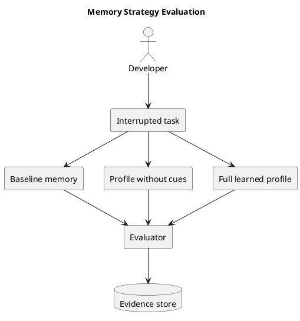

# MemoryVault tool requirements

Last updated: 2026-04-01

## Summary

MemoryVault is a local-first tool for learning how a long-running AI system should remember.

Its first job is simple: help an agent stay on the same task until the work is done.

Its second job is equally important: learn which kinds of memory actually make that possible.

The tool should preserve the parts that agents tend to lose first:

- the active goal
- the current plan and step status
- constraints, decisions, blockers, and open questions
- attempts, outcomes, failures, and lessons
- links back to the code, documents, notes, and raw history those records came from

MemoryVault is not being built as a domain-specific assistant. It is being built as a memory-learning tool that begins with minimal domain assumptions and improves from evidence.

The release path from the current prototype line to a truthful `1.0.0` is captured in [docs/release_plan.md](release_plan.md).

## `1.0` product identity

`MemoryVault 1.0` is a local-first memory-learning workbench.

It is for learning which memory structures and retrieval strategies help long-running work resume cleanly across task families.

It is not, in `1.0`, a shared production memory service, a finalized shared HTTP or MCP platform surface, or a live production-trace platform.

## Problem

Large language models are good at local reasoning and weak at long-running continuity.

In real work this shows up in a few predictable ways:

- the prompt fills up and older but important context falls out
- repeated summaries wash out technical detail
- similarity search finds related text but misses structure, authority, and sequence
- the agent forgets what has already been tried
- the agent loses the current plan, or drifts away from it
- decisions and constraints stop shaping later steps

This hurts long-running work of many kinds. One missed constraint, one forgotten failed attempt, or one lost source reference can waste hours even when the surrounding task domain changes.

## Tool goal

Give an agent a stable working memory that survives across sessions and helps it answer the same six questions every time:

1. What am I trying to finish?
2. What is the current plan?
3. What step am I on right now?
4. What constraints and decisions still apply?
5. What already happened, including failures?
6. Where did this information come from?

If MemoryVault does that reliably, it is doing its job.

The tool must also answer a seventh question for its developer:

7. Which memory fields and retrieval strategies actually improved resumed work?

## Who this is for

### Primary user

A developer or researcher building long-running AI systems and trying to learn what memory structure is worth keeping.

### Secondary user

An AI agent that will eventually consume the resulting memory system once the tool has learned which fields and strategies help.

## Tool principles

- Task state comes before broad recall.
- Start with near-zero domain knowledge.
- Treat the memory schema as something to discover and refine.
- Source links matter. Memory without traceability is not enough.
- Short-term work, durable memory, and raw history should stay separate.
- A good memory system should help the agent avoid repeating failed work.
- Compression is useful, but it should not come before reliable task-state retrieval.
- The system should stay local-first and inspectable.
- At design time, use simulated tasks or public Hugging Face datasets when real traces are unavailable.

## What the tool must do

### 1. Preserve task state

MemoryVault must store and retrieve:

- the active task
- the plan and active step
- success criteria
- blockers and open questions
- constraints and decisions
- recent attempts, outcomes, failures, and lessons

This is the minimum working memory for long-running agent work.

### 2. Learn from interrupted runs

The tool must be able to:

- run or import interrupted task traces
- rebuild a resume packet
- measure what was forgotten
- compare repeated misses across tasks
- propose which fields deserve promotion into durable memory

### 3. Keep different kinds of memory separate

The tool needs distinct layers for:

- session state: the live workbench for one conversation or run
- scratchpad: temporary notes and intermediate reasoning
- candidate memory: extracted fields that are still hypotheses
- durable memory: promoted records worth keeping
- raw history: the exact source material for re-checking or rehydration

These layers should be linked, but they should not be collapsed into one blob.

Within durable memory, the system should also keep different roles distinct:

- source evidence: what the system directly observed or imported
- derived summaries: compact views built from that evidence
- judgment-like records: conclusions or preferences that go beyond raw observation

This matters because a generated summary or conclusion should not silently replace the underlying source-backed record.

### 4. Keep source and trust information

High-value memory items must keep:

- source references
- provenance
- confidence or trust signals
- when something happened and when it was recorded or updated, where that distinction matters

The system should be able to point back to the source of a memory instead of asking the model to "just remember."

### 5. Compare strategies, not just outputs

The tool should be able to compare:

- different extraction rules
- different resume packet contents
- different retrieval bundles
- different memory budgets

The point is to learn which memory strategy helps across tasks, not only to produce one static architecture.

The current implemented comparison slice now also includes:

- versioned workspace profiles
- recorded strategy runs with score, timing, and task-family metadata
- short improvement notes that capture what helped, what regressed, and what to try next
- a transfer benchmark that checks whether a learned profile helps on a different task family
- a cross-run summary that shows recurring wins and gaps, task-family impact, cost patterns, profile history, and cue-transfer evidence
- cue-only measurements so the tracker can separate the effect of cue phrases from the rest of the learned profile
- a refresh loop that turns prior successful evidence into a candidate next profile and only keeps it if the held-out benchmark improves
- a fixed offline release benchmark bundle over saved public-data fixtures so each release can be compared against the same baseline, cue-disabled, and adapted scores

### 6. Understand relationships

The tool should eventually keep relationships between:

- tasks and plan steps
- files and symbols
- documents and sections
- decisions and the components they affect
- attempts and outcomes
- summaries and the source material they compress

This is why a graph-backed design is part of the current direction.

### 7. Support exact recovery

When a compressed or summarized memory is not enough, the system must be able to recover the underlying detail from raw history or source material.

### 8. Stay useful under cost limits

MemoryVault should improve continuity without creating runaway cost.

Success is not only better recall. Success is better recall at a reasonable token, latency, and retrieval cost.

### 9. Integrate cleanly with real agents

MemoryVault should be able to serve:

- one local agent
- one remote agent
- many agents sharing the same workspace
- non-agent systems such as workflow runners or evaluation harnesses

The current preferred integration shape is:

- a versioned HTTP and JSON core service
- an MCP adapter for agent-native access
- an asynchronous event plane for background work and cache invalidation

The system should stay platform-neutral by keeping the core service contract independent from any one agent host or SDK.

The first implemented integration slice is now intentionally small:

- one local HTTP service
- one shared local service core behind it
- four endpoints for the first supported workflow:
  - append task events
  - create or update task state
  - read a resume packet
  - retrieve the control-plane memory view
- explicit version markers on that narrow path:
  - `api_version: "v1"` in HTTP request and response envelopes
  - `artifact_schema_version: "service_task_state.v1"` in saved local task-state files
- local compatibility behavior on that path:
  - schema-less local task-state files are treated as legacy `service_task_state.v1`
  - unknown local task-state schemas fail with clear compatibility errors
- write protection on that path:
  - state-changing writes accept `If-Match` with the current `task_version`
  - stale writes fail with a clear precondition error instead of silently overwriting newer state
- retry protection on that path:
  - state-changing writes may include `Idempotency-Key`
  - a repeated write with the same key and the same request returns the original result
  - reusing the same key for a different write fails clearly
- request validation on that path:
  - state-changing request bodies must be JSON objects
  - malformed nested event and expected-item payloads fail clearly before any task state is changed
- a monotonic `task_version` counter on each saved task aggregate so repeated updates and event appends are visible and testable

This began as the first concrete `0.6.x` slice and now serves as the supported path on the released `1.0.0` line.

### 10. Become useful quickly in a new workspace

MemoryVault should not require a human to hand-author an ontology before it works.

The current preferred onboarding model is:

- zero-touch initialization by default
- a generated starter pack as an optional YAML hint layer
- representative-sample adaptation and candidate type discovery
- cheap provisional graph bootstrapping for the knowledge plane
- held-out onboarding checks before promoted defaults are trusted

The first implemented onboarding slice now also includes:

- learned event-label aliases for common non-default task markers such as `Focus`, `Evidence`, and `Guardrail`
- learned cue phrases for free-form notes so current focus, decisions, lessons, open questions, source grounding, and control state can survive even when the trace does not use explicit labels
- adapters that turn saved Hugging Face dataset rows into onboarding scenarios
  The current adapter set covers TaskBench, SWE-bench Verified, QASPER, and conversation-bench style rows.
- strategy records and transfer checks so onboarding improvements can be tested for reuse instead of only for same-family gains
- cue-only measurements so the tracker can separate the effect of cue phrases from the rest of the learned profile
- a benchmark-gated refresh step so prior successful profiles can shape the next workspace profile without becoming automatic truth

## Current release benchmark contract

The current `0.5.x` release benchmark contract is intentionally small and repeatable:

- run `python3 -m memoryvault release-benchmark`
- execute the fixed offline public bundle built from the saved TaskBench, SWE-bench Verified, QASPER, and conversation-bench row fixtures
- include one fixed transfer check from TaskBench to conversation-bench style rows
- write one `release_benchmark_report.json` artifact with stable case ids, bundle version, project version, and per-case baseline, cue-disabled, and adapted scores

This is the first release benchmark contract, not the final `1.0.0` gate.

## Current release verification gate

The released `1.0.0` line keeps a concrete verification command:

- `python3 -m memoryvault release-candidate-check`

That gate verifies the current `1.0` promise and helps keep later maintenance releases honest. It checks:

- product identity agreement across the README, PRD, and release plan
- the current supported integration surface for the local HTTP path
- the documented and implemented compatibility story for core saved artifacts
- the presence of the normal quality gate
- the fixed release benchmark bundle definition
- and, unless `--skip-benchmark` is used, one real execution of the release benchmark bundle

This keeps the released `1.0.0` support promise runnable instead of leaving it as documentation only.

## Current `1.0` support promise

For the released `1.0.0` line, the `1.0` support promise is explicit:

- supported integration surface:
  - the local HTTP path with `POST /v1/events`
  - `PUT /v1/tasks/{task_id}/state`
  - `GET /v1/tasks/{task_id}/resume-packet`
  - `POST /v1/tasks/{task_id}/retrieve`
- supported verification commands:
  - `python3 -m memoryvault release-benchmark`
  - `python3 -m memoryvault release-candidate-check`
- supported saved artifacts:
  - `workspace_profile.json`
  - `onboarding_benchmark.json`
  - `transfer_benchmark.json`
  - `strategy_record.json`
  - `release_benchmark_report.json`
  - local task-state files written as `service_task_state.v1`

Version upgrade expectations for that supported surface are:

- additive fields are allowed within a schema version
- breaking shape or meaning changes require a new schema version
- a new schema version also requires a documented migration path or an explicit break notice in the release notes

## Experimental And Non-Contractual

The following surfaces are still treated as non-contractual on the stable line:

- built-in sample and demo commands
- public-data discovery commands
- Hugging Face adapter workflow commands
- bundled sample data ids and example fixture layouts

They can still be useful, but they are not part of the stable `1.0` support promise.

## Current artifact compatibility rule

The current compatibility promise is also intentionally narrow:

- `workspace_profile.json` carries both a content-based `profile_version` and an `artifact_schema_version`
- `onboarding_benchmark.json`, `transfer_benchmark.json`, `strategy_record.json`, and `release_benchmark_report.json` carry an `artifact_schema_version`
- schema-less early versions of those saved artifacts are treated as legacy current-version files from the pre-`1.0` line
- unknown schema versions fail clearly instead of being guessed at
- additive fields are allowed within the current schema version
- removing fields, renaming fields, or changing meaning requires a new schema version and a documented migration or explicit break notice before a stable release

## What the tool should not do in v1

- It should not try to solve every memory problem at once.
- It should not assume one domain is representative of all future use.
- It should not start with aggressive compression as the first implementation target.
- It should not depend on a blank database. The current Memgraph target is shared.
- It should not turn every piece of temporary reasoning into durable memory.
- It should not hide important state inside free-form summaries.
- It should not optimize for benchmark scores that look good but break long-run continuity.
- It should not require private production traces to make progress.

## Phase 1 scope

Phase 1 should prove that the basic learning loop works.

It should start with a discovery step instead of pretending the full memory model is already known. The first version should run simulated or public interrupted tasks, inspect what was forgotten on resume, and only then promote recurring patterns into the core memory model.

That means:

- one interrupted task can be recorded and resumed locally
- the runtime resume package always keeps the final goal visible
- one active task can be stored and resumed
- the plan and step status can be retrieved reliably
- constraints, decisions, failures, lessons, and assumptions can be recovered when they matter
- the system can link those records back to raw source material
- the runtime context always includes the goal and current state before wider retrieval
- repeated misses can be aggregated into candidate durable fields
- the Memory Wind Tunnel can remove fields and show which ones actually damage resumed work
- the same loop can run on synthetic traces and public Hugging Face datasets
- a zero-touch onboarding flow can derive a first workspace profile, generate an optional starter pack, and test it on held-out traces
- the design stays safely isolated inside the shared Memgraph instance on `odin:7697`

If phase 1 cannot do those things, later compression work is premature.

## Success measures

MemoryVault is succeeding when:

- the agent keeps the same goal and plan across long-running work
- the agent stops repeating failures that are already in memory
- important constraints survive long enough to affect later steps
- high-value memories can be traced back to the source that supports them
- promoted memory fields come from repeated evidence instead of guesswork
- the system beats naive prompt history and naive summaries on continuity across more than one task family
- the memory layer adds bounded cost instead of uncontrolled overhead

## Current scope boundaries

The repo is now in an early stable-product stage for the supported `1.0` surface, while broader shared-service work remains earlier-stage design work.

Today the project already has:

- a detailed design note
- a research summary
- a zero-touch onboarding prototype over bundled interrupted-task traces
- a first set of Hugging Face row adapters for TaskBench, SWE-bench Verified, QASPER, and conversation-bench style inputs
- a strategy note for zero-domain-knowledge development
- a reviewed architecture direction
- a verified Memgraph target
- a local discovery loop that records interrupted runs, extracts candidate memories, builds resume packets, and logs missing memory patterns
- a Memory Wind Tunnel that removes memory fields and ranks the damage
- built-in and imported synthetic traces for several task shapes
- a registry of Hugging Face benchmark leads for later evaluation
- a local commit gate that requires Python linting, Markdown linting, passing tests, and at least 95% coverage
- basic logging and observability artifacts for local runs
- an integration strategy for HTTP, MCP, multi-agent coordination, and caching
- an onboarding strategy for zero-touch priming, optional starter packs, and ongoing learning
- a first local HTTP service slice for task-state updates, event appends, resume-packet reads, and control-plane retrieval

Today the project does not yet have:

- a production memory pipeline
- a working Memgraph integration in the codebase
- a benchmark harness
- live production traces
- live Hugging Face downloads wired into automated tests
- broad strategy comparison across multiple public task families
- centralized dashboards or external tracing infrastructure
- the planned MCP adapter, event plane, or shared-cache layer
- the prompt-adaptation and provisional graph-bootstrapping parts of the planned onboarding flow

## Open tool questions

- Which repeated misses from the discovery loop should become first-class durable memory?
- Which synthetic trace families are most informative before public benchmark adapters are built?
- Which public Hugging Face datasets best cover cross-domain memory failure modes without pushing the tool into one narrow task style?
- How much structure should be generated into the starter pack before the tool starts overfitting a workspace too early?
- Which onboarding metrics best predict later usefulness: first-resume quality, field coverage, graph noise, or time-to-first-useful-run?
- What belongs in Memgraph and what should stay in files or object storage?
- How thin can the MCP adapter stay while the HTTP core remains the source of truth?
- Which event broker should be the first real implementation target after the event contract is fixed?
- How should procedural playbooks be reviewed, updated, and retired?
- How much human curation should be required before durable memory changes?
- What is the right default boundary between fast retrieval and deeper rehydration?
- How should importance, freshness, and confidence be combined for ranking?
- How should durable memory label source evidence, derived summaries, and judgment-like records without making the first schema too heavy?
- When should MemoryVault track both when something happened and when it was recorded or updated?
- When is multi-channel retrieval worth its extra cost over simpler retrieval paths?

## Short version

MemoryVault exists to learn how a long-running AI system should remember.

It should help an agent remember the goal, keep the plan, respect constraints, learn from failure, and show where its memory came from. It should also learn, from simulated and public tasks, which memory fields and strategies are actually worth keeping.
