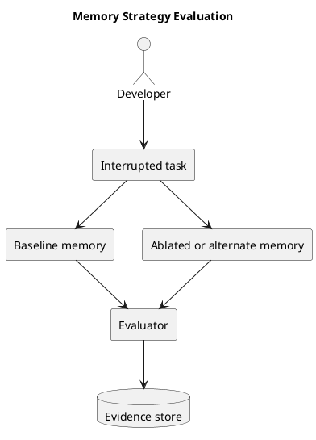

# MemoryVault tool requirements

Last updated: 2026-03-24

## Summary

MemoryVault is a local-first tool for learning how a long-running AI system should remember.

Its first job is simple: help an agent stay on the same task until the work is done.

Its second job is equally important: learn which kinds of memory actually make that possible.

The tool should preserve the parts that agents tend to lose first:

- the active goal
- the current plan and step status
- constraints, decisions, blockers, and open questions
- attempts, outcomes, failures, and lessons
- links back to the code, documents, notes, and raw history those records came from

MemoryVault is not being built as a domain-specific assistant. It is being built as a memory-learning tool that begins with minimal domain assumptions and improves from evidence.

## Problem

Large language models are good at local reasoning and weak at long-running continuity.

In real work this shows up in a few predictable ways:

- the prompt fills up and older but important context falls out
- repeated summaries wash out technical detail
- similarity search finds related text but misses structure, authority, and sequence
- the agent forgets what has already been tried
- the agent loses the current plan, or drifts away from it
- decisions and constraints stop shaping later steps

This hurts long-running work of many kinds. One missed constraint, one forgotten failed attempt, or one lost source reference can waste hours even when the surrounding task domain changes.

## Tool goal

Give an agent a stable working memory that survives across sessions and helps it answer the same six questions every time:

1. What am I trying to finish?
2. What is the current plan?
3. What step am I on right now?
4. What constraints and decisions still apply?
5. What already happened, including failures?
6. Where did this information come from?

If MemoryVault does that reliably, it is doing its job.

The tool must also answer a seventh question for its developer:

7. Which memory fields and retrieval strategies actually improved resumed work?

## Who this is for

### Primary user

A developer or researcher building long-running AI systems and trying to learn what memory structure is worth keeping.

### Secondary user

An AI agent that will eventually consume the resulting memory system once the tool has learned which fields and strategies help.

## Tool principles

- Task state comes before broad recall.
- Start with near-zero domain knowledge.
- Treat the memory schema as something to discover and refine.
- Source links matter. Memory without traceability is not enough.
- Short-term work, durable memory, and raw history should stay separate.
- A good memory system should help the agent avoid repeating failed work.
- Compression is useful, but it should not come before reliable task-state retrieval.
- The system should stay local-first and inspectable.
- At design time, use simulated tasks or public Hugging Face datasets when real traces are unavailable.

## What the tool must do

### 1. Preserve task state

MemoryVault must store and retrieve:

- the active task
- the plan and active step
- success criteria
- blockers and open questions
- constraints and decisions
- recent attempts, outcomes, failures, and lessons

This is the minimum working memory for long-running agent work.

### 2. Learn from interrupted runs

The tool must be able to:

- run or import interrupted task traces
- rebuild a resume packet
- measure what was forgotten
- compare repeated misses across tasks
- propose which fields deserve promotion into durable memory

### 3. Keep different kinds of memory separate

The tool needs distinct layers for:

- session state: the live workbench for one conversation or run
- scratchpad: temporary notes and intermediate reasoning
- candidate memory: extracted fields that are still hypotheses
- durable memory: promoted records worth keeping
- raw history: the exact source material for re-checking or rehydration

These layers should be linked, but they should not be collapsed into one blob.

### 4. Keep source and trust information

High-value memory items must keep:

- source references
- provenance
- confidence or trust signals
- time or freshness metadata where it matters

The system should be able to point back to the source of a memory instead of asking the model to "just remember."

### 5. Compare strategies, not just outputs

The tool should be able to compare:

- different extraction rules
- different resume packet contents
- different retrieval bundles
- different memory budgets

The point is to learn which memory strategy helps across tasks, not only to produce one static architecture.

### 6. Understand relationships

The tool should eventually keep relationships between:

- tasks and plan steps
- files and symbols
- documents and sections
- decisions and the components they affect
- attempts and outcomes
- summaries and the source material they compress

This is why a graph-backed design is part of the current direction.

### 7. Support exact recovery

When a compressed or summarized memory is not enough, the system must be able to recover the underlying detail from raw history or source material.

### 8. Stay useful under cost limits

MemoryVault should improve continuity without creating runaway cost.

Success is not only better recall. Success is better recall at a reasonable token, latency, and retrieval cost.

## What the tool should not do in v1

- It should not try to solve every memory problem at once.
- It should not assume one domain is representative of all future use.
- It should not start with aggressive compression as the first implementation target.
- It should not depend on a blank database. The current Memgraph target is shared.
- It should not turn every piece of temporary reasoning into durable memory.
- It should not hide important state inside free-form summaries.
- It should not optimize for benchmark scores that look good but break long-run continuity.
- It should not require private production traces to make progress.

## Phase 1 scope

Phase 1 should prove that the basic learning loop works.

It should start with a discovery step instead of pretending the full memory model is already known. The first version should run simulated or public interrupted tasks, inspect what was forgotten on resume, and only then promote recurring patterns into the core memory model.

That means:

- one interrupted task can be recorded and resumed locally
- the runtime resume package always keeps the final goal visible
- one active task can be stored and resumed
- the plan and step status can be retrieved reliably
- constraints, decisions, failures, lessons, and assumptions can be recovered when they matter
- the system can link those records back to raw source material
- the runtime context always includes the goal and current state before wider retrieval
- repeated misses can be aggregated into candidate durable fields
- the Memory Wind Tunnel can remove fields and show which ones actually damage resumed work
- the same loop can run on synthetic traces and public Hugging Face datasets
- the design stays safely isolated inside the shared Memgraph instance on `odin:7697`

If phase 1 cannot do those things, later compression work is premature.

## Success measures

MemoryVault is succeeding when:

- the agent keeps the same goal and plan across long-running work
- the agent stops repeating failures that are already in memory
- important constraints survive long enough to affect later steps
- high-value memories can be traced back to the source that supports them
- promoted memory fields come from repeated evidence instead of guesswork
- the system beats naive prompt history and naive summaries on continuity across more than one task family
- the memory layer adds bounded cost instead of uncontrolled overhead

## Current scope boundaries

The repo is now in an early discovery-prototype stage.

Today the project already has:

- a detailed design note
- a research summary
- a strategy note for zero-domain-knowledge development
- a reviewed architecture direction
- a verified Memgraph target
- a local discovery loop that records interrupted runs, extracts candidate memories, builds resume packets, and logs missing memory patterns
- a Memory Wind Tunnel that removes memory fields and ranks the damage
- built-in and imported synthetic traces for several task shapes
- a registry of Hugging Face benchmark leads for later evaluation
- a local commit gate that requires Python linting, Markdown linting, passing tests, and at least 90% coverage
- basic logging and observability artifacts for local runs

Today the project does not yet have:

- a production memory pipeline
- a working Memgraph integration in the codebase
- a benchmark harness
- live production traces
- Hugging Face dataset adapters wired into the codebase
- broad strategy comparison across multiple public task families
- centralized dashboards or external tracing infrastructure

## Open tool questions

- Which repeated misses from the discovery loop should become first-class durable memory?
- Which synthetic trace families are most informative before public benchmark adapters are built?
- Which public Hugging Face datasets best cover cross-domain memory failure modes without pushing the tool into one narrow task style?
- What belongs in Memgraph and what should stay in files or object storage?
- How should procedural playbooks be reviewed, updated, and retired?
- How much human curation should be required before durable memory changes?
- What is the right default boundary between fast retrieval and deeper rehydration?
- How should importance, freshness, and confidence be combined for ranking?

## Short version

MemoryVault exists to learn how a long-running AI system should remember.

It should help an agent remember the goal, keep the plan, respect constraints, learn from failure, and show where its memory came from. It should also learn, from simulated and public tasks, which memory fields and strategies are actually worth keeping.
