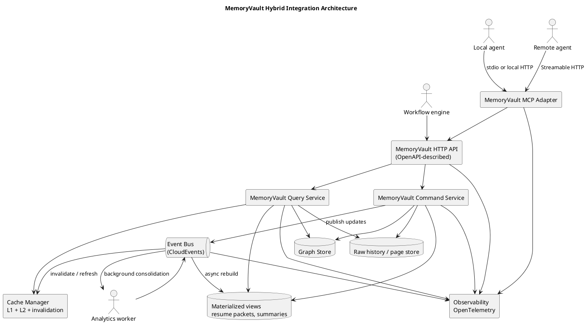
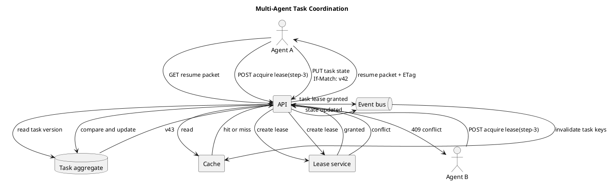

# MemoryVault integration strategy

Last updated: 2026-03-24

## Decision summary

The most effective platform-neutral way to integrate MemoryVault into real agents is a hybrid design with one canonical core and two adapters:

- canonical core: a versioned HTTP and JSON service described with OpenAPI
- agent adapter: an MCP server layered on top of the same core service
- asynchronous plane: broker-neutral events described as CloudEvents

This is the recommended split because it keeps the memory system usable from:

- local desktop agents
- remote coding agents
- web backends
- workflow engines
- batch workers
- multi-agent systems

The core service should be the source of truth. MCP should be the easiest way for agents to consume it. Messaging should handle background work, fan-out, subscriptions, and cache invalidation.

## Why this shape

### Why not MCP only

MCP is the right agent-facing interface, but it is not the best sole systems boundary for a shared infrastructure component.

The current MCP specification is JSON-RPC based, supports `stdio` and Streamable HTTP, and remote servers can handle multiple clients and stateful sessions. That makes it excellent for agent interoperability and local-to-remote deployment. It is weaker as the only contract for non-agent consumers, background workers, and cross-language service ecosystems that expect normal HTTP APIs and event streams.

### Why not HTTP only

An HTTP API is the cleanest canonical systems contract, but agents increasingly expect MCP primitives such as tools, resources, and prompts. If MemoryVault exposed only HTTP, every host would need its own custom adapter, which would fragment behavior and increase maintenance.

### Why not messaging only

Messaging is excellent for asynchronous memory extraction, consolidation, cache invalidation, and fan-out. It is poor as the only interface for low-latency retrieval, direct task resume, or deterministic request-response flows.

### Recommended answer

Use:

- HTTP and JSON as the source-of-truth service interface
- MCP as the first-class agent compatibility layer
- CloudEvents over a broker as the asynchronous integration layer

## Standards and sources behind the decision

- MCP now defines `stdio` and HTTP-based transports, and remote servers are designed to handle multiple clients: https://modelcontextprotocol.io/specification/2024-11-05/basic/transports
- MCP architecture guidance explicitly separates host, client, and server, and notes that remote Streamable HTTP servers usually serve many clients: https://modelcontextprotocol.io/docs/learn/architecture
- MCP server primitives are already a strong fit for MemoryVault: tools for actions, resources for context, prompts for reusable memory workflows: https://modelcontextprotocol.io/docs/learn/architecture
- OpenAPI is explicitly language-agnostic and intended to let humans and computers understand an HTTP API surface with minimal implementation logic: https://spec.openapis.org/oas/v3.1.1.html
- CloudEvents is a common event description format with broad SDK support across major languages: https://cloudevents.io/
- NATS JetStream is horizontally scalable, persistent, and provides key-value and object-store features; its KV layer supports watch, TTL, `create`, and CAS-style `update`: https://docs.nats.io/nats-concepts/jetstream and https://docs.nats.io/using-nats/developer/develop_jetstream/kv
- OpenTelemetry provides traces, metrics, logs, baggage, and context propagation across service boundaries: https://opentelemetry.io/docs/concepts/signals/ and https://opentelemetry.io/docs/concepts/context-propagation/
- HTTP conditional requests are the right base mechanism for cache validation and lost-update protection with `If-None-Match` and `If-Match`: https://www.rfc-editor.org/rfc/rfc9110

## Reference architecture



## Integration contracts

### 1. Canonical HTTP API

The canonical contract should be a versioned HTTP and JSON API.

Reasons:

- easiest cross-language integration path
- simplest place to enforce tenancy, auth, quotas, and concurrency rules
- best fit for OpenAPI-generated clients and stable SDKs
- natural home for conditional requests, ETags, idempotency keys, and pagination

The HTTP API should expose synchronous operations such as:

- append interaction events
- create or update task state
- get deterministic resume packets
- query memory by task, source, or evidence
- search raw history
- acquire and renew task-step leases
- subscribe to change cursors or webhooks

Suggested first endpoints:

- `POST /v1/events`
- `PUT /v1/tasks/{task_id}/state`
- `GET /v1/tasks/{task_id}/resume-packet`
- `POST /v1/tasks/{task_id}/retrieve`
- `POST /v1/tasks/{task_id}/leases/{plan_step_id}`
- `DELETE /v1/tasks/{task_id}/leases/{plan_step_id}`
- `GET /v1/changes`

### 2. MCP adapter

The MCP layer should be an adapter over the HTTP API, not a separate business-logic fork.

That adapter should support:

- `stdio` for local sidecar or desktop use
- Streamable HTTP for shared remote deployment

MemoryVault should expose a small set of MCP primitives:

- tools
  - `memory_append_event`
  - `memory_upsert_task_state`
  - `memory_get_resume_packet`
  - `memory_report_outcome`
  - `memory_search_sources`
  - `memory_acquire_step_lease`
- resources
  - `memory://workspace/{workspace_id}/task/{task_id}/resume-packet`
  - `memory://workspace/{workspace_id}/task/{task_id}/control-plane`
  - `memory://workspace/{workspace_id}/task/{task_id}/recent-failures`
  - `memory://workspace/{workspace_id}/task/{task_id}/sources`
- prompts
  - `resume-task`
  - `review-failures`
  - `promote-memory-fields`

Design rule:

- tools should mutate or trigger work
- resources should expose stable read models
- prompts should encode reusable workflows, not hidden state

### 3. Event plane

The event plane should use CloudEvents envelopes so the broker can change without changing the message contract.

Good first event types:

- `memoryvault.task.event.appended`
- `memoryvault.task.state.updated`
- `memoryvault.resume_packet.rebuilt`
- `memoryvault.memory.promoted`
- `memoryvault.cache.invalidate`
- `memoryvault.observability.run.completed`

The first broker target should be NATS JetStream because it gives one practical stack for:

- streams for durable async processing
- KV for cache metadata, versions, and lightweight coordination
- object store for larger payloads if needed

The contract, though, should remain broker-neutral.

## Single-agent and multi-agent use

### Single-agent mode

Use a local sidecar:

- agent talks to MCP over `stdio`
- MCP adapter talks to local HTTP service or directly to the local core
- local file or embedded store remains acceptable early on

This keeps startup simple and preserves the local-first development style.

### Shared multi-agent mode

Use the shared service:

- agents connect through MCP Streamable HTTP or directly to the HTTP API
- durable memory is shared at workspace scope
- scratchpads remain private at agent or session scope unless explicitly promoted
- write coordination happens through leases, optimistic concurrency, and idempotency keys

### Infrastructure rule

Treat MemoryVault as an infrastructure component when multiple agents use it.

That means:

- it owns tenancy and authorization
- it exposes service-level SLOs
- it carries request IDs and trace IDs
- it provides cache coherence and invalidation
- it does not assume one host process or one agent runtime

## Tenancy and concurrency model

MemoryVault should support at least four identity levels:

- `tenant_id`: billing and security boundary
- `workspace_id`: shared memory boundary for a team, repo, or project
- `agent_id`: identity of one agent actor
- `session_id` and `run_id`: execution boundary for a single run

Task records should also carry:

- `task_id`
- `plan_id`
- `plan_step_id`
- `memory_version`

Rules:

- durable memory is partitioned by `tenant_id` and `workspace_id`
- scratchpads are partitioned by `agent_id` and `session_id`
- caches must never mix data across tenant, workspace, auth scope, or strategy version
- all mutable task aggregates need explicit version numbers

To support concurrent writers:

- use append-only event ingestion for raw chronology
- use optimistic concurrency on task aggregates
- require idempotency keys on command writes
- use short-lived leases for exclusive ownership of active plan steps
- keep lease renewal heartbeat-based, not permanent



## Caching strategy

Caching should be a first-class part of the design, not an afterthought.

### Cache layers

- L1 cache: in-process, short-lived, request-coalescing cache inside each API or MCP instance
- L2 cache: shared distributed cache or KV for hot read models
- source of truth: graph store, raw-history store, and materialized views

### What to cache

Best cache targets:

- deterministic resume packets
- control-plane task snapshots
- recent-failure lists
- source reference bundles
- graph neighborhood expansions
- MCP tool and resource metadata

Do not treat these as durable truth:

- agent-private scratchpads
- authorization decisions without scope checks
- mutable task state without version tags

### Cache keys

Every cache key should include:

- tenant
- workspace
- task
- auth scope or principal
- strategy version
- retrieval policy or memory budget

This prevents cross-tenant leakage and avoids serving stale data for the wrong strategy configuration.

### Freshness rules

Use different rules for different data classes:

- control-plane resume packet: version-based invalidation first, TTL second
- knowledge-plane retrieval bundles: short TTL plus background refresh
- metadata and schemas: longer TTL
- negative cache entries: very short TTL

### Validation and lost-update protection

Use HTTP validators and versions:

- `ETag` on read models such as resume packets
- `If-None-Match` for efficient revalidation
- `If-Match` on state-changing writes to prevent lost updates

### Invalidation

Invalidation should be event-driven:

- command write commits
- emit update event
- invalidate affected task, workspace, and derived-view keys
- asynchronously rebuild hot views

### Cache stampede protection

Use:

- request coalescing or single-flight per hot key
- background refresh for high-traffic keys
- warm-up when a task becomes active

### Recommended first implementation

For the first shared-service version:

- L1: process-local memory cache
- L2: JetStream KV or another distributed KV with watch and CAS support
- invalidation: CloudEvents over JetStream

```plantuml
@startuml
title Cache Read And Invalidation Flow

actor Client
rectangle "HTTP API / MCP Adapter" as Edge
rectangle "L1 cache" as L1
rectangle "L2 cache" as L2
database "Views + graph + raw store" as Store
queue "Event bus" as Bus

Client -> Edge : GET resume packet
Edge -> L1 : lookup
alt L1 hit
  L1 --> Edge : packet
else L1 miss
  Edge -> L2 : lookup
  alt L2 hit
    L2 --> Edge : packet + version
    Edge -> L1 : fill
  else L2 miss
    Edge -> Store : build packet
    Store --> Edge : packet + version
    Edge -> L2 : fill
    Edge -> L1 : fill
  end
end
Edge --> Client : packet + ETag

Client -> Edge : PUT task state (If-Match)
Edge -> Store : update aggregate
Store --> Edge : committed
Edge -> Bus : publish invalidate event
Bus -> L2 : invalidate keys
Bus -> Edge : optional local fanout
@enduml
```

## Security and authorization

The shared service should support:

- bearer-token auth on HTTP
- tenant and workspace scopes
- service-to-service credentials for workers
- per-tool or per-server auth at the MCP layer, depending on deployment

Important MCP-specific rules from the current docs:

- Streamable HTTP servers should validate `Origin`
- local servers should bind to localhost when possible
- remote servers should use proper authentication

For tenant safety:

- authorization is enforced in HTTP handlers first
- business logic re-checks scope before data access
- caches include auth scope in keys
- events carry tenant and workspace identity explicitly

## Observability

The service should adopt OpenTelemetry from the integration phase, not later.

Use:

- traces for request paths and downstream calls
- metrics for cache hit rate, rebuild time, queue lag, lease conflicts, and retrieval latency
- logs for audit and failure diagnosis
- baggage or propagated context for `tenant_id`, `workspace_id`, `task_id`, `session_id`, and `run_id`

Key metrics:

- resume packet p50, p95, p99 latency
- control-plane cache hit rate
- derived-view rebuild latency
- write conflict rate
- lease acquisition conflict rate
- event lag
- per-tenant storage growth

## Rollout phases

### Phase 1: local sidecar

- keep the current local-first workflow
- add the canonical HTTP core locally
- add an MCP `stdio` adapter
- no shared broker yet

### Phase 2: shared service

- deploy the HTTP core remotely
- add OpenAPI contract and generated SDKs
- add MCP Streamable HTTP adapter
- add tenancy, auth, ETags, and optimistic concurrency

### Phase 3: event plane

- add CloudEvents contracts
- add broker-backed async workers
- add event-driven cache invalidation
- add materialized-view rebuilds

### Phase 4: multi-agent coordination

- add step leases and heartbeats
- add watcher subscriptions
- add workspace quotas and policy controls
- add cross-run analytics and aggregate observability

## Recommended near-term implementation plan

1. Define the HTTP API contract and object model before writing adapters.
2. Define the tenant, workspace, task, and session identifiers and carry them everywhere.
3. Build the MCP adapter as a thin translation layer over the HTTP core.
4. Add ETag and `If-Match` semantics before shared multi-agent writes.
5. Add L1 and L2 caches with explicit event-driven invalidation.
6. Add CloudEvents contracts before choosing a permanent broker implementation.
7. Add step leases before allowing shared task editing from more than one agent.
8. Add OpenTelemetry spans, metrics, and logs with propagated task identity.

## Bottom line

The best integration strategy is not MCP alone, not HTTP alone, and not messaging alone.

It is:

- one canonical HTTP and JSON memory service
- one MCP adapter for agent-native use
- one event plane for asynchronous updates and cache coherence

That gives MemoryVault a clean platform-neutral center while still fitting the way modern agents actually integrate with tools.
