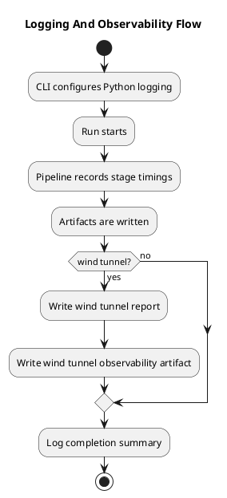

# Logging and observability

Last updated: 2026-03-24

MemoryVault now has two basic observability layers:

- Python logging for run lifecycle events
- per-run observability artifacts with timings, counts, and summary metrics

This is intentionally small. The goal is to make runs inspectable without adding heavy infrastructure too early.

## What is logged

The tool now logs:

- when a scenario run starts
- when a scenario run ends
- when a wind tunnel starts
- when a wind tunnel ends
- the run id, score, candidate counts, and fragile fields where relevant

The CLI can control this with:

- `--log-level`
- `--log-file`

## What is recorded as observability data

Each run now writes an `observability.json` artifact with:

- start and finish times
- total duration
- per-stage durations
- event counts
- candidate counts
- source counts
- evaluation check counts
- score

Wind tunnel runs also write `wind_tunnel_observability.json` with:

- wind tunnel variant count
- fragile fields

## Flow

## Current limits

- logs are local only
- metrics are per-run JSON artifacts, not a live dashboard
- there is no external tracing backend
- there is no alerting or anomaly detection yet

## Next useful observability upgrades

- compare duration and damage trends across runs
- keep a cross-run leaderboard of fragile fields
- log which extraction rules produced each durable field
- track strategy comparison cost as well as quality
- add public-benchmark level summary reports once dataset adapters exist
