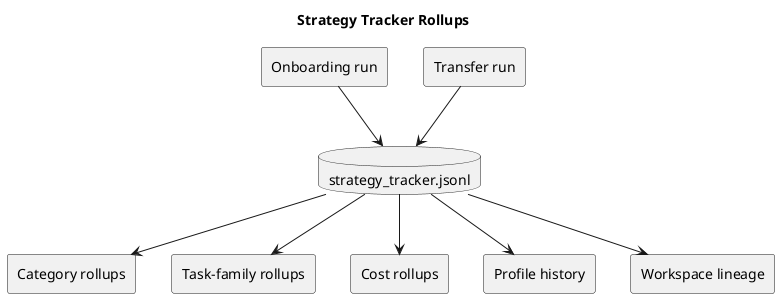
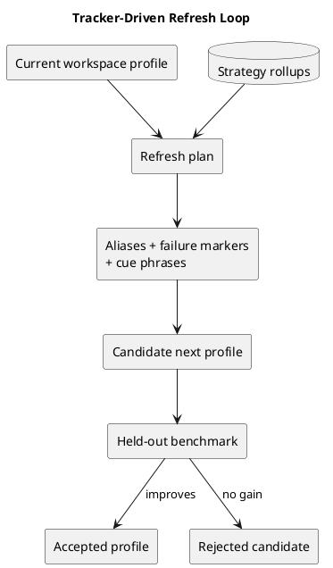
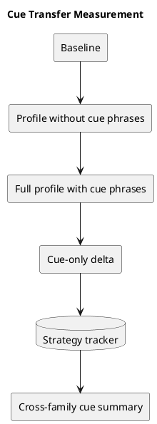
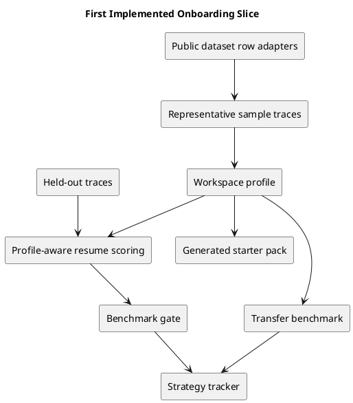
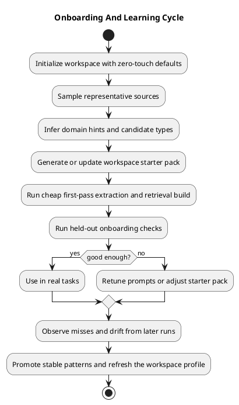
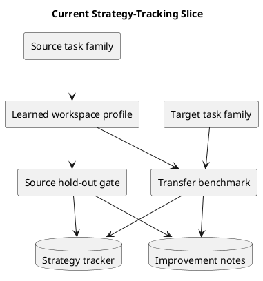
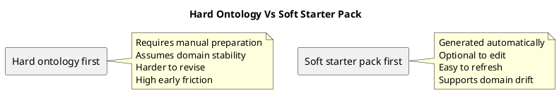

# MemoryVault onboarding, priming, and learning strategy

Last updated: 2026-03-25

## Decision summary

The next minor release should focus on making MemoryVault become useful fast without requiring manual setup.

The recommended strategy is:

- zero-touch onboarding by default
- optional soft starter packs in YAML
- representative-sample prompt adaptation and type discovery
- cheap first-pass graph bootstrapping for the knowledge plane only
- held-out benchmark checks before promoting anything into durable defaults
- continuous refresh based on misses, drift, and changed source material

The most important point is this:

- a hand-built ontology must be optional
- a starter pack must be a hint layer, not the source of truth
- semi-automatic graph creation is useful, but only as one input into onboarding

## Current implemented slice

The repository now has the first thin onboarding implementation.

Today it can:

- load a directory of interrupted-task JSON traces
- pick a representative sample automatically
- learn a first workspace profile from that sample
- generate an optional YAML starter pack
- hold out the remaining traces for validation
- rerun those held-out traces with the learned profile
- pass or fail an onboarding gate based on the score delta
- adapt saved Hugging Face dataset rows into the same onboarding gate
- assign a stable profile version based on the learned profile contents
- record strategy runs with score, timing, and task-family metadata
- write short improvement notes after each onboarding, transfer, or refresh run
- test whether a learned profile transfers to a different task family
- summarize recurring wins and gaps, task-family impact, cost patterns, and profile history across runs
- run an explicit refresh loop that builds a candidate next profile from prior successful evidence and only keeps it if the held-out benchmark improves
- carry forward richer evidence such as learned content cues for free-form notes, not only label aliases and failure markers
- measure the cue-only contribution separately so the tracker can tell which cue categories actually transferred

The current learned adaptation is intentionally narrow but no longer single-purpose:

- it expands the failure-marker vocabulary used for `recent_failures`
- it learns extra event-label aliases such as `Focus`, `Evidence`, and `Guardrail`
- it learns free-form cue phrases such as `before anything else`, `so we will`, `this means`, `still unclear whether`, `according to`, `stay within`, and `waiting on` so unlabeled notes can still recover current focus, decisions, lessons, open questions, sources, constraints, and blockers

That is enough to prove the onboarding loop can learn from sample data and improve held-out performance without pretending the broader onboarding plan is already finished.









## Why this is the right next release

MemoryVault is still at the stage where it needs to learn what matters.

That means the next release should not try to hard-code a final worldview. It should instead answer four practical questions quickly:

1. How does a new workspace get to a first useful resume packet fast?
2. How does the tool infer what matters without private training data?
3. How does it improve after a few real or simulated tasks?
4. How does it avoid locking in bad assumptions too early?

The release theme should therefore be onboarding and learning, not storage sophistication.

## Research-backed conclusion

The strongest current pattern is not "start by writing an ontology."

It is:

- start with representative input
- infer domain and candidate structure automatically
- tune extraction prompts to the input
- keep the control-plane schema stable and minimal
- let broader knowledge-plane structure emerge and get tested

This matches the current GraphRAG documentation from Microsoft:

- auto prompt tuning is "highly encouraged" and manual tuning is described as advanced
- automatic entity-type discovery is recommended when the data is broad or highly varied
- FastGraphRAG is cheaper and faster but noisier than the standard method
- bring-your-own graph is supported, which makes existing graphs or ontologies useful as optional inputs rather than mandatory prerequisites

Sources:

- https://microsoft.github.io/graphrag/prompt_tuning/auto_prompt_tuning/
- https://microsoft.github.io/graphrag/prompt_tuning/overview/
- https://microsoft.github.io/graphrag/index/methods/
- https://microsoft.github.io/graphrag/index/byog/

## Recommended onboarding model

### What should be fixed from day one

The control plane should still be fixed and explicit:

- goal
- plan
- active step
- constraints
- decisions
- blockers
- attempts
- outcomes
- failures
- lessons
- source references

These are not optional and should not depend on ontology induction.

### What should be learned

The knowledge plane should be learned and refined:

- candidate entity types
- candidate relation types
- source trust patterns
- document and file importance
- useful summaries
- reusable playbooks
- ranking hints for retrieval

This is where optional starter packs and graph bootstrapping help.

## The recommended cycle



### Stage 1: zero-touch workspace initialization

This should require no manual preparation.

Inputs can include:

- repo files
- docs
- tests
- local run history
- imported traces
- synthetic traces
- public benchmark data from Hugging Face

Output:

- a first workspace profile
- a first source-priority map
- a first set of candidate entity and relation types
- a first onboarding benchmark plan

### Stage 2: representative sampling

Do not run expensive extraction over everything first.

Instead:

- sample a small but representative set of sources
- bias toward authoritative files such as tests, ADRs, README files, architecture notes, and active task traces
- run domain inference and extraction adaptation on that sample

This is where Microsoft GraphRAG's auto prompt tuning pattern is useful.

### Stage 3: soft starter pack generation

The tool should generate a workspace starter pack automatically.

This should be:

- optional
- editable
- regenerable
- safe to ignore

It should not be treated as a hand-maintained ontology requirement.

The best use of YAML here is as a soft schema and policy file, not a rigid ontology file.

### Stage 4: cheap first-pass graph bootstrapping

Semi-automatic graph creation is still useful, but only if it is kept in the right role.

Recommendation:

- use a cheap first-pass extraction method to get broad candidate structure fast
- use higher-fidelity extraction only on high-value slices
- do not confuse this first graph with durable truth

This is where a FastGraphRAG-style approach is valuable:

- fast enough for bootstrapping
- cheap enough to rerun
- noisy enough that it must remain provisional

### Stage 5: onboarding benchmark gate

Before trusting the result, run onboarding checks on held-out tasks.

This should measure:

- time to first useful resume packet
- control-plane coverage
- evidence grounding
- retrieval usefulness
- graph noise level
- cost and latency

### Stage 6: live learning and refresh

Once the tool is in use, it should keep learning from:

- repeated misses
- stale summaries
- outdated source priorities
- recurring failures
- changed repositories or docs

The onboarding result is therefore not a one-time setup. It becomes a refreshable workspace profile.

The first implemented version of that refresh idea is now explicit:

- previous successful strategy runs are filtered by workspace and task-family overlap
- their rollups choose which aliases, failure markers, cue phrases, source priorities, and starter-pack fields are worth carrying forward
- a candidate refreshed profile is built from that evidence
- the candidate is benchmarked on the current held-out traces
- the candidate is only kept when the benchmark actually improves

## Current strategy-learning addition

The onboarding loop now has one more implemented layer beyond the original held-out gate:

- every learned profile gets a content-based version
- every onboarding or transfer run writes a strategy record
- every run also writes short timestamped improvement notes
- a transfer benchmark can learn on one task family and score on another
- cue-disabled comparisons now show how much of a gain came from cue phrases specifically
- the tracker can now roll those results up by cue category and task family

This does not yet mean MemoryVault has a full strategy archive or profile-evolution engine. It means the tool can now begin to answer a harder and more useful question:

- did this learned profile only help the data it came from, or does it help elsewhere too?



## Proposed starter pack YAML

The starter pack should exist, but only as an optional soft hint file.

It should not be called an ontology unless the workspace truly needs one.

Proposed shape:

```yaml
version: 1
workspace:
  domain_hint: null
  language_hint: null
  primary_goals:
    - preserve_goal_plan_failure_source
sources:
  priority_order:
    - tests
    - architecture_docs
    - readme
    - task_traces
    - source_files
  include_globs: []
  exclude_globs: []
  authority_hints: []
extraction:
  discover_entity_types: true
  candidate_entity_types: []
  candidate_relation_types: []
  allow_claim_extraction: true
  sample_strategy: representative
memory:
  required_control_fields:
    - goal
    - plan
    - active_step
    - constraint
    - decision
    - failure
    - source_ref
  candidate_fields:
    - assumptions
    - recent_failures
    - open_questions
    - decision_rationale
  failure_markers:
    - weak
    - unavailable
  prefix_aliases:
    current_focus:
      - focus
    source:
      - evidence
    constraint:
      - guardrail
retrieval:
  prefer_goal_conditioning: true
  require_source_grounding: true
  default_budget: medium
benchmarks:
  profiles:
    - taskbench_tool_use
    - swe_bench_like
    - qasper_grounding
policies:
  manual_edits_optional: true
  promote_only_after_repeated_evidence: true
```

Important rule:

- this file should usually be generated first and edited only if the user wants to

## Why a soft starter pack beats a hard ontology



A hard ontology-first path is only appropriate when:

- the workspace is narrow
- the entity vocabulary is stable
- the team already has a trusted schema
- precision matters more than startup speed

That is not the default MemoryVault use case.

## Role of semi-automatic graph creation

Semi-automatic graph creation is not useless or outdated.

It is just not the main onboarding answer.

Use it for:

- candidate entity discovery
- candidate relation discovery
- source clustering
- early graph neighborhoods
- candidate summaries and community views

Do not use it as:

- the sole definition of task state
- the sole definition of truth
- a required manual setup step
- a justification for skipping benchmarking

## Public data for onboarding evaluation

Because private onboarding traces do not exist yet, the release should use public and synthetic inputs.

Recommended public data:

- `microsoft/Taskbench` for domain-agnostic tool-use structure
- `princeton-nlp/SWE-bench_Verified` and `nebius/SWE-agent-trajectories` for code and issue workflows
- `allenai/qasper` for evidence-grounded document work
- `DFKI-SLT/few-nerd` for fine-grained type discovery evaluation
- `thunlp/docred` for relation and multi-sentence extraction evaluation

Useful links:

- https://huggingface.co/datasets/microsoft/Taskbench
- https://huggingface.co/datasets/princeton-nlp/SWE-bench_Verified
- https://huggingface.co/datasets/nebius/SWE-agent-trajectories
- https://huggingface.co/datasets/allenai/qasper
- https://huggingface.co/datasets/DFKI-SLT/few-nerd
- https://huggingface.co/datasets/thunlp/docred

## What the next minor release should include

### Must include

- one zero-touch workspace initialization flow
- one generated starter pack format
- one representative-sample selection step
- one prompt adaptation step
- one cheap first-pass graph bootstrapping option
- one onboarding benchmark gate
- one refresh loop that updates the workspace profile from misses and drift

### Should include

- one optional manual override path for the starter pack
- one benchmark report that compares:
  - no starter pack
  - generated starter pack
  - edited starter pack
- one clear separation between control-plane onboarding and knowledge-plane onboarding

### Should not include

- mandatory ontology authoring
- mandatory graph editing by humans
- full-schema hardening before benchmark evidence exists
- a claim that onboarding is solved after one indexing run

## Proposed release sequencing

1. Generate a workspace profile from representative sources.
2. Produce a starter pack YAML automatically.
3. Run prompt adaptation and candidate type discovery.
4. Build a cheap first-pass graph and retrieval bundle.
5. Evaluate on held-out onboarding tasks.
6. Promote only the patterns that clearly improve resumed work.
7. Refresh the profile as new evidence arrives.

## Bottom line

The best onboarding strategy is not "ask the user to define the world."

It is:

- infer a first workspace profile automatically
- use a generated YAML starter pack as an optional hint layer
- use semi-automatic graph creation as a provisional accelerator
- benchmark the result before trusting it
- keep learning from misses and drift

That is the fastest path to a tool that becomes useful quickly and stays useful over time without requiring manual preparation.
