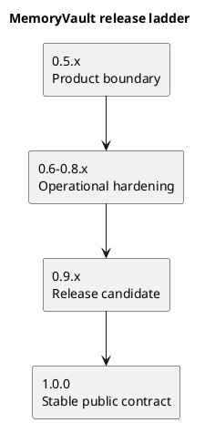
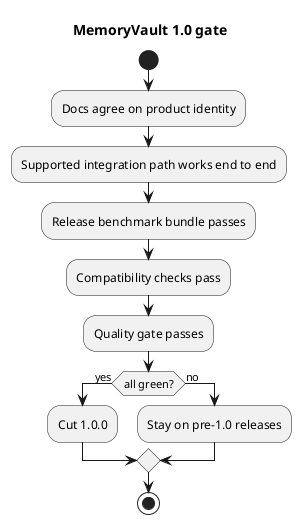

# MemoryVault release plan

Last updated: 2026-04-01

## Purpose

This document defines the practical path from the current discovery prototype to a release that deserves `1.0.0`.

The main rule is simple:

- `1.0.0` should mean MemoryVault has one stable product identity, one supported integration path, one repeatable benchmark gate, and one compatibility story that users can rely on.

It should not merely mean that the prototype has become large.

## Current state

The repository has now cut `1.0.0` around a smaller, explicit stable boundary.

That stable boundary is:

- a local-first memory-learning workbench
- with one supported local HTTP integration path
- with one repeatable release verification gate
- with one explicit compatibility promise for core saved artifacts

The broader shared-service, MCP, event-plane, and Memgraph-backed direction remains planned work after the first stable release.

Before that cut, the repository was best described as:

- a strong local memory-learning harness
- with a first local HTTP integration slice
- with real onboarding, transfer, refresh, and observability features
- but without a release-grade shared or production integration surface
- and without a release-grade benchmark contract

That was why the `0.9.x` release-candidate line existed before the stable cut.

## Release ladder

## Release 0.5.x

### Goal

Turn the current prototype into a clearly scoped product candidate.

For this release line, the choice is now explicit:

- `MemoryVault 1.0` is a local-first memory-learning workbench
- it is not yet an agent-facing shared memory service

### What this release should do

- choose and state the primary identity of the project
- define what is in scope for `1.0.0`
- define what is explicitly not required for `1.0.0`
- stabilize the local learning workflow so it feels intentional instead of exploratory
- make benchmark reporting easier to compare across runs

### Required changes

- publish one clear project promise:
  - `MemoryVault 1.0` is a memory-learning workbench
- write a stable benchmark summary command and artifact format
- define the first public benchmark bundle that every release must run
- define the first compatibility policy for saved workspace profiles and run artifacts
- tighten the README and PRD so they describe one main product instead of two future shapes

### First public benchmark bundle

The first fixed public release bundle for `0.5.x` is:

- onboarding over saved `hf_taskbench` rows
- onboarding over saved `hf_swe_bench_verified` rows
- onboarding over saved `hf_qasper` rows
- onboarding over saved `hf_conversation_bench` rows
- one fixed transfer check from `hf_taskbench` to `hf_conversation_bench`

The bundle should be run through one stable command:

- `python3 -m memoryvault release-benchmark`

The bundle artifact should be one stable JSON report:

- `release_benchmark_report.json`
- includes bundle id, bundle version, project version, fixed case ids, task-family coverage, and per-case baseline, cue-disabled, and adapted scores

### First compatibility policy

The first compatibility policy for `0.5.x` is:

- `workspace_profile.json` carries both a content-based `profile_version` and an explicit `artifact_schema_version`
- `onboarding_benchmark.json`, `transfer_benchmark.json`, `strategy_record.json`, and `release_benchmark_report.json` carry an explicit `artifact_schema_version`
- schema-less early versions of those saved artifacts are treated as legacy current-version files during the pre-`1.0` line
- unknown schema versions must fail clearly or be handled by an explicit migration
- additive fields are allowed within a schema version
- removed or renamed fields, or semantic meaning changes, require a new schema version and a documented migration or explicit release-note break notice

### Exit criteria

- the README, PRD, and release plan all describe the same `1.0` product identity
- the repo has one documented release benchmark bundle covering several task families
- benchmark outputs are stable enough to compare one release to another
- workspace profile and artifact versioning rules are documented
- the team can answer, in one sentence, what `1.0` is for

### Not required yet

- Memgraph integration
- live production traces
- MCP or HTTP integration in code
- shared-service deployment

## Releases 0.6.x to 0.8.x

### Goal

Build the minimum operational foundation that a `1.0.0` release would need.

### What these releases should do

- implement one real supported integration path
- make storage and compatibility less provisional
- improve benchmark coverage and reporting quality
- prove that the tool still works when used in a more realistic loop

### Preferred implementation order

1. Define and implement one canonical service contract.
2. Expose one supported agent-facing path over that contract.
3. Add stable persistence and compatibility checks.
4. Harden the benchmark and artifact story.

### Recommended `0.6.0` milestone

The first `0.6.0` release should be intentionally narrow.

Its job is not to ship the whole long-term integration model. Its job is to prove that MemoryVault has one real supported path that is more stable than the current CLI-only prototype workflow.

#### Scope

- implement one thin local HTTP service
- keep the existing CLI as a client or wrapper where practical
- expose only the smallest workflow that proves the product boundary
- leave MCP, CloudEvents, shared deployment, and Memgraph wiring for later minor releases

#### First supported workflow

The first supported end-to-end workflow should be:

1. append or import task events
2. update task state
3. request a deterministic resume packet
4. retrieve the resulting control-plane memory view

This is the minimum slice that turns MemoryVault from a local harness into a usable integration surface.

#### Suggested first contract

The first `0.6.0` HTTP contract should stay small:

- `POST /v1/events`
- `PUT /v1/tasks/{task_id}/state`
- `GET /v1/tasks/{task_id}/resume-packet`
- `POST /v1/tasks/{task_id}/retrieve`

These endpoints are enough to prove the canonical service boundary without locking the project into a larger premature API.

#### Work sequence

1. Define request and response shapes for the first four endpoints.
2. Extract a small service-layer core so the CLI and HTTP path share the same business rules.
3. Implement the local HTTP server over that shared core.
4. Add end-to-end tests for the supported workflow through HTTP.
5. Document the new supported path in the README and product docs.

#### First implementation checklist

Start with the smallest file-level slice that can prove the path end to end:

- `memoryvault/service.py`
  - move the core "append events / update state / build resume packet / retrieve memory view" workflow behind one shared boundary
- `memoryvault/http_api.py`
  - add the first local HTTP handlers for the four `v1` endpoints
- `memoryvault/cli.py`
  - keep the CLI working by calling the shared core instead of duplicating behavior
- `tests/test_service.py`
  - verify the shared core returns the expected task state, resume packet, and retrieval view
- `tests/test_http_api.py`
  - verify the four HTTP endpoints work end to end on representative local scenarios
- `README.md`
  - add the new supported local-service workflow and how to run it
- `docs/PRD.md`
  - update the supported surface description once the local HTTP path exists
- `docs/release_plan.md`
  - keep the `0.6.0` milestone, scope, and exit criteria aligned with what was actually built

The first tests to add should be:

- one end-to-end happy-path service test
- one end-to-end happy-path HTTP test
- one versioning or shape-stability test for the first request and response payloads
- one regression test proving the CLI path and HTTP path return the same resume packet for the same input

#### `0.6.0` exit criteria

- one local HTTP service is implemented and documented
- the first four endpoints are stable and tested
- the CLI and HTTP path reuse the same core logic rather than forking behavior
- one end-to-end resume workflow works through HTTP from input to resume packet
- the normal quality gate passes
- the repo can describe one supported `0.6.0` integration path in plain language

#### Explicitly out of scope for `0.6.0`

- MCP implementation
- CloudEvents implementation
- shared multi-agent deployment
- Memgraph-backed persistence
- cache and lease APIs beyond what the current local workflow strictly needs

### Required changes

- implement either:
  - a thin HTTP core service
  - or a thin MCP adapter over a local service boundary
- define request and artifact versioning clearly
- define durable memory class markers so source evidence, derived summaries, and any judgment-like records do not silently collapse into one store type
- define time semantics for durable memory items, including when something happened and when it was recorded or updated
- keep compatibility tests for old saved profiles, benchmarks, and strategy records current as new schema-bearing artifacts are added
- add a release benchmark report that compares:
  - baseline memory
  - full learned profile
  - cue-disabled profile
  - at least one ablated or weaker variant
- expand public-data coverage enough that one benchmark family cannot dominate the release decision

### Exit criteria

- one supported integration path is implemented and documented
- one saved profile from the previous minor release can still be loaded or cleanly migrated
- the release benchmark runs across at least three task families
- release reports make regressions obvious
- the project can show a stable user workflow that is more than “run the prototype scripts”

### Not required yet

- multi-agent shared deployment
- event bus
- full Memgraph architecture
- centralized observability stack
- preference-conditioned opinion or persona layers

## Release 0.9.x

### Goal

Act like `1.0.0` before cutting `1.0.0`.

The repository did run on an actual `release/0.9.x` branch with version `0.9.0`, so this line became a real rehearsal rather than only hypothetical planning.

### What this release should do

- freeze the public contract
- run the final release gate repeatedly
- remove ambiguous or experimental surface area from the `1.0` promise
- confirm that docs, release behavior, and compatibility guarantees all match

### Required changes

- declare the public CLI and or service contract that `1.0.0` will support
- mark experimental commands or artifacts as non-contractual if needed
- define the `1.0` support promise for:
  - profile format
  - benchmark bundle
  - integration surface
  - version upgrade expectations
- run at least one full release-candidate cycle using the same gate planned for `1.0.0`

### Current `1.0` support promise

By the end of the `0.9.x` line, the repo treated these as the intended `1.0` contractual surface:

- supported integration surface:
  - `POST /v1/events`
  - `PUT /v1/tasks/{task_id}/state`
  - `GET /v1/tasks/{task_id}/resume-packet`
  - `POST /v1/tasks/{task_id}/retrieve`
- supported verification commands:
  - `python3 -m memoryvault release-benchmark`
  - `python3 -m memoryvault release-candidate-check`
- supported saved artifacts:
  - `workspace_profile.json`
  - `onboarding_benchmark.json`
  - `transfer_benchmark.json`
  - `strategy_record.json`
  - `release_benchmark_report.json`
  - local task-state files written as `service_task_state.v1`
- version upgrade expectations:
  - additive fields are allowed within a schema version
  - breaking shape or meaning changes require a new schema version
  - a new schema version also requires a documented migration path or an explicit break notice in the release notes

### Experimental And Non-Contractual

The following were still treated as non-contractual on the release-candidate line:

- built-in sample and demo commands
- public-data discovery commands
- Hugging Face adapter workflow commands
- bundled sample data ids and example fixture layouts

Those can still evolve before or after `1.0.0` without changing the supported `1.0` promise above.

### Concrete gate command

The `0.9.x` release-candidate line used one concrete repo-local gate command:

- `python3 -m memoryvault release-candidate-check`

That command should verify:

- the README, PRD, and release plan still agree on one `1.0` product identity
- the supported local HTTP path is still the documented public integration boundary
- the current `1.0` support promise and the experimental, non-contractual surfaces are both documented clearly
- the compatibility story for core saved artifacts is both documented and implemented
- the normal quality gate still exists and covers linting, typing, tests, markdown, version sync, and coverage
- the fixed release benchmark bundle is still defined correctly
- and, unless `--skip-benchmark` is used, the current release benchmark bundle still passes

This was the concrete `0.9.x` rehearsal for the later `1.0.0` gate.

### Exit criteria

- no major open ambiguity remains about what `1.0.0` supports
- the `0.9.x` release gate passes without special-case exceptions
- docs no longer call the project a discovery prototype in the areas that `1.0` intends to stabilize
- the team would be comfortable telling outside users to start building against the chosen `1.0` boundary

### Stop signs

Do not cut `1.0.0` from `0.9.x` if any of these are still true:

- the product identity is still split between “learning harness” and “shared service”
- the benchmark gate is still being invented during release week
- saved profiles or artifacts can break silently between versions
- the supported integration path is still described more than implemented

## Release 1.0.0

### Current status

`1.0.0` has now been cut from the exercised `0.9.x` line.

The stable `1.0` surface is:

- the four-endpoint local HTTP path
- the fixed release verification commands
- the documented compatibility promise for the core saved artifacts
- the explicit boundary between supported and experimental CLI surfaces

### What `1.0.0` should mean

`1.0.0` now means:

- one stable product identity
- one supported integration path
- one release benchmark contract
- one compatibility promise for the core saved artifacts
- one documented path for upgrades and release verification

### Current `1.0` support promise

For the released `1.0.0` line, the repo treats these as the supported contract:

- supported integration surface:
  - `POST /v1/events`
  - `PUT /v1/tasks/{task_id}/state`
  - `GET /v1/tasks/{task_id}/resume-packet`
  - `POST /v1/tasks/{task_id}/retrieve`
- supported verification commands:
  - `python3 -m memoryvault release-benchmark`
  - `python3 -m memoryvault release-candidate-check`
- supported saved artifacts:
  - `workspace_profile.json`
  - `onboarding_benchmark.json`
  - `transfer_benchmark.json`
  - `strategy_record.json`
  - `release_benchmark_report.json`
  - local task-state files written as `service_task_state.v1`
- version upgrade expectations:
  - additive fields are allowed within a schema version
  - breaking shape or meaning changes require a new schema version
  - a new schema version also requires a documented migration path or an explicit break notice in the release notes

### Experimental And Non-Contractual

The following remain outside the stable `1.0` contract:

- built-in sample and demo commands
- public-data discovery commands
- Hugging Face adapter workflow commands
- bundled sample data ids and example fixture layouts

They can keep evolving after `1.0.0` without changing the supported contract above.

### Minimum release gate

### Exact exit criteria

- the chosen `1.0` product identity is consistent across README, PRD, strategy, and release notes
- the supported integration path is implemented, documented, and tested
- the release benchmark bundle passes across multiple task families
- benchmark reports include at least baseline, full profile, and cue-disabled comparisons
- core saved artifacts have a documented compatibility and migration story
- the normal quality gate passes, including coverage and linters
- the changelog and versioning flow are release-ready

## Recommended next sequence

1. Cut `0.5.0` around product-boundary clarity and release-benchmark definition.
2. Use `0.6.x` to implement the first supported integration path.
3. Use `0.7.x` and `0.8.x` to harden compatibility and release reporting.
4. Use `0.9.x` as a true release-candidate line.
5. Cut `1.0.0` only when the repo can honestly stop calling itself a discovery prototype for the supported surface.

That cut has now happened for the local-first supported surface.

## What I would not block 1.0 on

- full Memgraph integration
- full multi-agent deployment
- event-bus implementation
- live private production traces
- the final long-term graph schema

Those are important, but they are not required for a truthful first stable release if the chosen `1.0` boundary is smaller and clearly stated.
