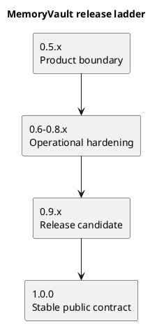
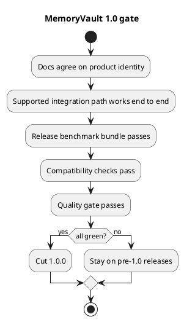

# MemoryVault release plan

Last updated: 2026-03-25

## Purpose

This document defines the practical path from the current discovery prototype to a release that deserves `1.0.0`.

The main rule is simple:

- `1.0.0` should mean MemoryVault has one stable product identity, one supported integration path, one repeatable benchmark gate, and one compatibility story that users can rely on.

It should not merely mean that the prototype has become large.

## Current state

Today the repository is still best described as:

- a strong local memory-learning harness
- with real onboarding, transfer, refresh, and observability features
- but without a production integration surface
- and without a release-grade benchmark contract

That makes another minor release appropriate, but not `1.0.0` yet.

## Release ladder

## Release 0.5.x

### Goal

Turn the current prototype into a clearly scoped product candidate.

For this release line, the choice is now explicit:

- `MemoryVault 1.0` is a local-first memory-learning workbench
- it is not yet an agent-facing shared memory service

### What this release should do

- choose and state the primary identity of the project
- define what is in scope for `1.0.0`
- define what is explicitly not required for `1.0.0`
- stabilize the local learning workflow so it feels intentional instead of exploratory
- make benchmark reporting easier to compare across runs

### Required changes

- publish one clear project promise:
  - `MemoryVault 1.0` is a memory-learning workbench
- write a stable benchmark summary command and artifact format
- define the first public benchmark bundle that every release must run
- define the first compatibility policy for saved workspace profiles and run artifacts
- tighten the README and PRD so they describe one main product instead of two future shapes

### First public benchmark bundle

The first fixed public release bundle for `0.5.x` is:

- onboarding over saved `hf_taskbench` rows
- onboarding over saved `hf_swe_bench_verified` rows
- onboarding over saved `hf_qasper` rows
- onboarding over saved `hf_conversation_bench` rows
- one fixed transfer check from `hf_taskbench` to `hf_conversation_bench`

The bundle should be run through one stable command:

- `python3 -m memoryvault release-benchmark`

The bundle artifact should be one stable JSON report:

- `release_benchmark_report.json`
- includes bundle id, bundle version, project version, fixed case ids, task-family coverage, and per-case baseline, cue-disabled, and adapted scores

### First compatibility policy

The first compatibility policy for `0.5.x` is:

- `workspace_profile.json` carries both a content-based `profile_version` and an explicit `artifact_schema_version`
- `onboarding_benchmark.json`, `transfer_benchmark.json`, and `release_benchmark_report.json` carry an explicit `artifact_schema_version`
- additive fields are allowed within a schema version
- removed or renamed fields, or semantic meaning changes, require a new schema version and a documented migration or explicit release-note break notice

### Exit criteria

- the README, PRD, and release plan all describe the same `1.0` product identity
- the repo has one documented release benchmark bundle covering several task families
- benchmark outputs are stable enough to compare one release to another
- workspace profile and artifact versioning rules are documented
- the team can answer, in one sentence, what `1.0` is for

### Not required yet

- Memgraph integration
- live production traces
- MCP or HTTP integration in code
- shared-service deployment

## Releases 0.6.x to 0.8.x

### Goal

Build the minimum operational foundation that a `1.0.0` release would need.

### What these releases should do

- implement one real supported integration path
- make storage and compatibility less provisional
- improve benchmark coverage and reporting quality
- prove that the tool still works when used in a more realistic loop

### Preferred implementation order

1. Define and implement one canonical service contract.
2. Expose one supported agent-facing path over that contract.
3. Add stable persistence and compatibility checks.
4. Harden the benchmark and artifact story.

### Required changes

- implement either:
  - a thin HTTP core service
  - or a thin MCP adapter over a local service boundary
- define request and artifact versioning clearly
- add compatibility tests for old saved profiles and strategy records
- add a release benchmark report that compares:
  - baseline memory
  - full learned profile
  - cue-disabled profile
  - at least one ablated or weaker variant
- expand public-data coverage enough that one benchmark family cannot dominate the release decision

### Exit criteria

- one supported integration path is implemented and documented
- one saved profile from the previous minor release can still be loaded or cleanly migrated
- the release benchmark runs across at least three task families
- release reports make regressions obvious
- the project can show a stable user workflow that is more than “run the prototype scripts”

### Not required yet

- multi-agent shared deployment
- event bus
- full Memgraph architecture
- centralized observability stack

## Release 0.9.x

### Goal

Act like `1.0.0` before cutting `1.0.0`.

### What this release should do

- freeze the public contract
- run the final release gate repeatedly
- remove ambiguous or experimental surface area from the `1.0` promise
- confirm that docs, release behavior, and compatibility guarantees all match

### Required changes

- declare the public CLI and or service contract that `1.0.0` will support
- mark experimental commands or artifacts as non-contractual if needed
- define the `1.0` support promise for:
  - profile format
  - benchmark bundle
  - integration surface
  - version upgrade expectations
- run at least one full release-candidate cycle using the same gate planned for `1.0.0`

### Exit criteria

- no major open ambiguity remains about what `1.0.0` supports
- the `0.9.x` release gate passes without special-case exceptions
- docs no longer call the project a discovery prototype in the areas that `1.0` intends to stabilize
- the team would be comfortable telling outside users to start building against the chosen `1.0` boundary

### Stop signs

Do not cut `1.0.0` from `0.9.x` if any of these are still true:

- the product identity is still split between “learning harness” and “shared service”
- the benchmark gate is still being invented during release week
- saved profiles or artifacts can break silently between versions
- the supported integration path is still described more than implemented

## Release 1.0.0

### What `1.0.0` should mean

`1.0.0` should mean:

- one stable product identity
- one supported integration path
- one release benchmark contract
- one compatibility promise for the core saved artifacts
- one documented path for upgrades and release verification

### Minimum release gate

### Exact exit criteria

- the chosen `1.0` product identity is consistent across README, PRD, strategy, and release notes
- the supported integration path is implemented, documented, and tested
- the release benchmark bundle passes across multiple task families
- benchmark reports include at least baseline, full profile, and cue-disabled comparisons
- core saved artifacts have a documented compatibility and migration story
- the normal quality gate passes, including coverage and linters
- the changelog and versioning flow are release-ready

## Recommended next sequence

1. Cut `0.5.0` around product-boundary clarity and release-benchmark definition.
2. Use `0.6.x` to implement the first supported integration path.
3. Use `0.7.x` and `0.8.x` to harden compatibility and release reporting.
4. Use `0.9.x` as a true release-candidate line.
5. Cut `1.0.0` only when the repo can honestly stop calling itself a discovery prototype for the supported surface.

## What I would not block 1.0 on

- full Memgraph integration
- full multi-agent deployment
- event-bus implementation
- live private production traces
- the final long-term graph schema

Those are important, but they are not required for a truthful first stable release if the chosen `1.0` boundary is smaller and clearly stated.
