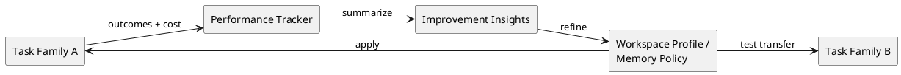

# Research Summary

Last updated: 2026-03-30

## Purpose

This document is the long-form research summary for MemoryVault. It complements `.codex/RESEARCH.md` and `.codex/RESEARCH_INTAKE.md` with a human-readable record of the papers and whitepapers that most changed the architecture.

The practical question behind every source review has been the same:

- how does the agent keep the goal, plan, constraints, current state, and outcome history intact across long-running work?
- how does it remember more without drifting, collapsing detail, or repeating failures?
- how do we preserve usefulness without letting cost and latency explode?

The current design assumption is that the tool begins without private production traces. That means the research needs to inform not only the memory architecture, but also how to learn and test that architecture with synthetic and public data.

## Combined Lessons That Survived Review

- The highest-priority memory is the active objective, current plan, success criteria, constraints, blockers, and prior outcomes.
- Session history, scratchpads, curated long-term memory, and exact raw history should be separate layers with different lifecycles.
- Retrieval should be goal-conditioned, but durable memory must stay tied to evidence and provenance so the system does not drift into self-confirming stories.
- Durable memory should distinguish source evidence, derived summaries, and subjective judgments so the system can tell what it saw from what it inferred.
- Long-horizon agents need an explicit goal reminder and a structured current-state header at runtime, not just a large pile of retrieved text.
- Time should usually mean both when something happened and when the system recorded or updated it.
- Durable declarative memory should use bounded maintenance actions such as add, update, invalidate, and no-op.
- Procedural memory should evolve as curated playbooks that accumulate tactics, checks, and failure-avoidance patterns.
- Monolithic whole-context rewriting is risky because it can collapse rich context into shallow summaries.
- Graph structure is valuable, but phase 1 should use it first for control state, provenance, and relationships, not for maximal knowledge-graph sophistication.
- Evaluation should optimize both usefulness and cost: task success, plan continuity, failure avoidance, token cost, latency, and extra steps.
- Performance tracking and timestamped improvement insights are part of the memory-learning loop, not just observability exhaust.
- A useful memory policy should be tested for transfer across task families; improvements that only help one benchmark are weaker than reusable ones.

## Quotes That Most Changed The Design

- [Context Engineering: Sessions, Memory](https://smallake.kr/wp-content/uploads/2025/12/Context-Engineering_-Sessions-Memory.pdf): "the session serves as the temporary workbench" and memory is the "organized filing cabinet."
  - Lesson: keep session state, scratch work, and durable memory separate.
- [Memory and the self](https://doi.org/10.1016/j.jml.2005.08.005): "the working self-modulates access to long-term knowledge."
  - Lesson: retrieval should be shaped by the active goal and current task identity.
- [General Agentic Memory Via Deep Research](https://arxiv.org/abs/2511.18423): "keeping only simple but useful memory" while preserving a "universal page-store."
  - Lesson: use lightweight durable memory plus a searchable raw-history backstop.
- [StateAct](https://arxiv.org/abs/2410.02810): the agent "reminds itself of the goal at every turn."
  - Lesson: active-task context should always restate the goal and structured state.
- [ACE: Agentic Context Engineering](https://arxiv.org/abs/2510.04618): "contexts as evolving playbooks."
  - Lesson: procedural guidance should grow incrementally instead of being repeatedly rewritten from scratch.
- [Mem0](https://arxiv.org/abs/2504.19413): "dynamically extracting, consolidating, and retrieving salient information."
  - Lesson: durable memory needs an explicit maintenance loop.
- [Everything is Context](https://arxiv.org/abs/2512.05470): "persistent, governed infrastructure."
  - Lesson: lineage, access control, and traceability belong in the design from the start.
- [Toward Efficient Agents](https://arxiv.org/abs/2601.14192): "Pareto frontier between effectiveness and cost."
  - Lesson: memory must be judged as a quality-versus-cost trade-off, not only by retrieval quality.
- [HyperAgents](https://arxiv.org/abs/2603.19461): persistent memory and performance tracking emerged as transferable self-improvement mechanisms.
  - Lesson: track strategy performance over time and test whether learned memory behavior transfers across task families.
- [Hindsight is 20/20](https://doi.org/10.48550/arXiv.2512.12818): memory should distinguish "world facts, agent experiences, synthesized entity summaries, and evolving beliefs."
  - Lesson: keep evidence, derived views, and judgments distinct instead of mixing them into one memory bucket.

## Source Assessments

### Core Now

- [Context Engineering: Sessions, Memory](https://smallake.kr/wp-content/uploads/2025/12/Context-Engineering_-Sessions-Memory.pdf)
  - Why it matters: best practical framing for splitting session state, memory generation, retrieval timing, provenance, and procedural memory.
  - Carry into MemoryVault: session store plus scratchpad plus durable memory plus raw-history backstop.

- [General Agentic Memory Via Deep Research](https://arxiv.org/abs/2511.18423)
  - Why it matters: strong argument for a complete searchable history behind a lighter memory layer.
  - Carry into MemoryVault: preserve a page-store or raw-history layer; let retrieval plan and search when exact detail matters.
  - Caution: this cannot replace explicit task, plan, and outcome memory.

- [Mem0: Building Production-Ready AI Agents with Scalable Long-Term Memory](https://arxiv.org/abs/2504.19413)
  - Why it matters: practical memory maintenance pattern with explicit updates instead of naive append-only growth.
  - Carry into MemoryVault: declarative memory should use add, update, invalidate, and no-op style actions.

- [Memory and the self](https://doi.org/10.1016/j.jml.2005.08.005)
  - Why it matters: useful first-principles frame for why active goals should shape memory access.
  - Carry into MemoryVault: retrieval should be goal-conditioned, but still checked against source correspondence and evidence.

### Useful Now

- [StateAct: Enhancing LLM Base Agents via Self-prompting and State-tracking](https://arxiv.org/abs/2410.02810)
  - Why it matters: directly addresses goal drift and long-context failure.
  - Carry into MemoryVault: every active-task prompt package should include an explicit goal reminder and a structured current-state section.

- [ACE: Agentic Context Engineering: Evolving Contexts for Self-Improving Language Models](https://arxiv.org/abs/2510.04618)
  - Why it matters: shows the danger of "context collapse" and the value of structured, incremental updates.
  - Carry into MemoryVault: procedural memory should be curated as evolving playbooks; avoid monolithic whole-context rewrites.
  - Caution: richer context is useful only if retrieval, governance, and control-state prioritization stay intact.

- [A-MEM: Agentic Memory for LLM Agents](https://arxiv.org/abs/2502.12110)
  - Why it matters: good pattern for note enrichment, structured attributes, and dynamic linking.
  - Carry into MemoryVault: use for the knowledge plane, especially document and repo memory.
  - Caution: do not let the same free-form evolution rewrite explicit control-plane state.

- [Everything is Context: Agentic File System Abstraction for Context Engineering](https://arxiv.org/abs/2512.05470)
  - Why it matters: reinforces governance, lineage, and explicit handling of memory, tools, and human input.
  - Carry into MemoryVault: keep state transitions auditable and make access control and retention explicit.
  - Caution: we do not need to commit to a literal file-system abstraction in phase 1.

- [Toward Efficient Agents: A Survey of Memory, Tool Learning, and Planning](https://arxiv.org/abs/2601.14192)
  - Why it matters: provides the right evaluation lens for cost-aware agent design.
  - Carry into MemoryVault: benchmark both quality and cost, and prefer hybrid memory management over always invoking heavy reasoning.

- [Generative Agents: Interactive Simulacra of Human Behavior](https://arxiv.org/abs/2304.03442)
  - Why it matters: observation, planning, and reflection work together; memory is not a stand-alone component.
  - Carry into MemoryVault: connect memory design tightly to planning and reflection instead of treating retrieval as enough.

- [Reflexion: Language Agents with Verbal Reinforcement Learning](https://arxiv.org/abs/2303.11366)
  - Why it matters: failed attempts become useful only when the agent can reuse them.
  - Carry into MemoryVault: store outcomes, reflections, and failure-avoidance lessons as first-class records.

- [MemGPT: Towards LLMs as Operating Systems](https://arxiv.org/abs/2310.08560)
  - Why it matters: tiered memory is useful when context windows are not enough.
  - Carry into MemoryVault: keep layered memory, but protect active task state in the most accessible durable tier.

- [HippoRAG: Neurobiologically Inspired Long-Term Memory for Large Language Models](https://arxiv.org/abs/2405.14831)
  - Why it matters: graph retrieval and graph ranking can outperform flat retrieval for multi-hop questions.
  - Carry into MemoryVault: add graph-native ranking such as Personalized PageRank after the first deterministic baseline works.

- [Hindsight is 20/20: Building Agent Memory that Retains, Recalls, and Reflects](https://doi.org/10.48550/arXiv.2512.12818)
  - Why it matters: it provides a concrete software-facing pattern for separating evidence from derived summaries and subjective judgments, while also reinforcing temporal metadata and fused retrieval.
  - Carry into MemoryVault: keep source evidence, derived views, and any future judgment layer distinct; track both occurrence time and recorded time when possible; regenerate summaries from evidence changes rather than treating them as truth.
  - Caution: the paper still has some rough edges in its evaluation write-up, and its preference-conditioned opinion layer is not a near-term need for MemoryVault's control plane.

- [From Local to Global: A Graph RAG Approach to Query-Focused Summarization](https://www.microsoft.com/en-us/research/publication/from-local-to-global-a-graph-rag-approach-to-query-focused-summarization/)
  - Why it matters: graph communities and summaries help with large-corpus sensemaking.
  - Carry into MemoryVault: useful for later corpus-level summaries and high-level planning views.

- [A survey on large language model based autonomous agents](https://link.springer.com/article/10.1007/s11704-024-40231-1)
  - Why it matters: confirms that memory and planning are part of one agent loop, not optional add-ons.
  - Carry into MemoryVault: keep memory, planning, and action continuity in one architecture.

### Useful Later Or Indirect

- [HyperGraphRAG: Retrieval-Augmented Generation with Hypergraph-Structured Knowledge Representation for Multi-Hop Reasoning](https://arxiv.org/abs/2503.21322)
  - Why it matters: binary edges can be too weak for complex facts.
  - Carry later: reified fact nodes or hyperedge-style modeling when simple property-graph relations become lossy.

- [Learning to Continually Learn via Meta-learning Agentic Memory Designs](https://arxiv.org/abs/2602.07755)
  - Why it matters: memory design itself may later become learnable.
  - Carry later: keep a stable `update` and `retrieve` boundary so the internals can evolve.

- [Huxley-Godel Machine](https://arxiv.org/abs/2510.21614)
  - Why it matters: local scores can hide worse long-run behavior.
  - Carry later: evaluate MemoryVault by downstream task continuity and long-run task completion, not only local memory scores.

- [HyperAgents](https://arxiv.org/abs/2603.19461)
  - Why it matters: it is one of the clearest recent examples showing that persistent memory and performance tracking can become reusable improvement machinery instead of one-off task hacks.
  - Carry now: add strategy-performance tracking and timestamped improvement insights to the learning loop; test transfer of learned workspace profiles across task families.
  - Caution: this is not a direct blueprint for MemoryVault's storage, retrieval, caching, or multi-agent design, and it should not push the project toward self-modifying agents as the next milestone.

- [MemoryBank: Enhancing Large Language Models with Long-Term Memory](https://arxiv.org/abs/2305.10250)
  - Why it matters: long-term memory and selective forgetting can help sustained interaction.
  - Carry later: selective forgetting may fit low-value episodic detail, but it should not touch active goals, plans, constraints, or failures.

## Architecture Implications For MemoryVault

- Control-plane memory comes first: objective, plan, active step, success criteria, blockers, constraints, decisions, attempts, outcomes, failures, lessons, and source references.
- The tool should begin with near-zero domain assumptions and let repeated misses shape the durable schema over time.
- Session state stays separate from durable memory, and both stay separate from exact raw history.
- Scratchpads and working state are explicit and auditable; they do not become durable memory automatically.
- Prompt assembly should always start with a deterministic task package that includes the goal and current state.
- Declarative memory should use explicit maintenance actions with provenance and confidence.
- Durable knowledge-plane records should say whether they are source evidence, a derived summary, or a judgment-like record so retrieval can mix them safely.
- Time metadata should distinguish when the underlying event happened from when MemoryVault recorded or updated it.
- Procedural memory should be maintained as evolving playbooks, with structured growth and review instead of whole-playbook rewrites.
- Graph structure should first serve control-state retrieval, provenance, and evidence linkage before more ambitious knowledge modeling.
- Derived summaries should be treated as regenerable views over evidence, not as primary truth.
- Later knowledge-plane retrieval should be able to fuse semantic, keyword, graph, and temporal signals instead of committing to a single channel.
- Benchmarking should include plan adherence, failure avoidance, task completion, token cost, latency, and extra tool or retrieval steps.
- Until real traces exist, benchmark input should come from synthetic traces and public Hugging Face datasets that can be converted into interrupted-task evaluations.
- The learning loop should also track profile versions, measured quality and cost over time, and whether improvements transfer across task families.

## Additional Research-Driven Direction

The `HyperAgents` paper is relevant, but only in a bounded way. It does not tell MemoryVault how to store or retrieve memory. What it does show is that two capabilities keep reappearing when systems get better at improving themselves:

- persistent memory that preserves synthesized lessons across runs
- performance tracking that helps later changes respond to evidence instead of guesswork

That is directly useful for MemoryVault's next stage because the project is already trying to learn which memory behavior helps. The practical addition is a closed loop that compares memory-profile variants, stores short timestamped improvement notes, and checks whether a profile that helped one task family also helps another.

## Official integration standards reviewed

For the integration strategy, it was useful to review a small set of current standards and official docs rather than rely only on papers:

- [Model Context Protocol](https://modelcontextprotocol.io/docs/learn/architecture) for agent-facing tools, resources, prompts, lifecycle, and transport choices
- [MCP transports](https://modelcontextprotocol.io/specification/2024-11-05/basic/transports) for the current `stdio` and HTTP-based model
- [OpenAPI](https://spec.openapis.org/oas/v3.1.1.html) for a language-agnostic HTTP contract
- [CloudEvents](https://cloudevents.io/) for portable asynchronous event contracts
- [NATS JetStream](https://docs.nats.io/nats-concepts/jetstream) and its [KV store](https://docs.nats.io/using-nats/developer/develop_jetstream/kv) for one practical first broker and cache-backplane target
- [OpenTelemetry signals](https://opentelemetry.io/docs/concepts/signals/) and [context propagation](https://opentelemetry.io/docs/concepts/context-propagation/) for platform-neutral observability
- [RFC 9110](https://www.rfc-editor.org/rfc/rfc9110) for conditional HTTP requests that support cache validation and protect against lost updates

The main integration lesson is simple:

- MCP is the right agent adapter
- HTTP is the right canonical service boundary
- events are the right asynchronous coordination layer

That conclusion is what shaped the new integration design in `docs/integration_strategy.md`.

## Onboarding-specific lessons

The onboarding question is slightly different from the long-run storage question:

- how do we become useful quickly in a new workspace?
- how much structure should be inferred versus supplied?
- how do we avoid requiring manual setup while still getting domain-adapted results?

The most useful current lesson from Microsoft's GraphRAG documentation is that automatic prompt adaptation is the normal path, and manual tuning is the advanced path. That is a strong signal for MemoryVault too.

The best current onboarding pattern appears to be:

- infer from representative samples first
- generate a soft workspace profile
- treat starter ontologies as optional hint files
- use cheap graph bootstrapping to get provisional structure fast
- validate on held-out tasks before trusting promoted defaults

That is why the new onboarding design in `docs/onboarding_strategy.md` favors generated starter packs over mandatory hand-authored ontologies.

One practical addition from Hugging Face's dataset-viewer documentation is also now useful: the `first-rows` response gives a stable JSON shape for public dataset samples. That makes it possible to build MemoryVault adapters around real public row formats while still keeping tests local and offline through saved row snapshots.

## Current Bottom Line

The research still does not support starting with compression. It supports starting with reliable control-state memory, goal-aware retrieval, explicit state tracking, source-grounded durable memory, and carefully curated procedural playbooks. The `HyperAgents` paper strengthened the case for performance tracking and transfer evaluation, and the `Hindsight` paper strengthened the case for keeping evidence, derived views, and judgments separate while carrying richer time semantics. Neither changes the priority order: control-plane truth still comes first.

## Public Benchmark Leads

These public Hugging Face datasets look like strong fits for MemoryVault's evaluation loop because they can be turned into interrupted-task tests instead of only one-shot scores:

- [princeton-nlp/SWE-bench_Verified](https://huggingface.co/datasets/princeton-nlp/SWE-bench_Verified): public software tasks with clear goals and test-based outcomes.
- [nebius/SWE-agent-trajectories](https://huggingface.co/datasets/nebius/SWE-agent-trajectories): full agent runs with failures, logs, and patches for interrupted-trace replay.
- [microsoft/Taskbench](https://huggingface.co/datasets/microsoft/Taskbench): tool-use planning and dependency graphs across several domains, good for a domain-agnostic tool.
- [xiaowu0162/longmemeval-cleaned](https://huggingface.co/datasets/xiaowu0162/longmemeval-cleaned): public long-memory conversational benchmark; the older `longmemeval` dataset is marked deprecated on Hugging Face.
- [arcada-labs/conversation-bench](https://huggingface.co/datasets/arcada-labs/conversation-bench): long-range dialogue, tool use, and memory stress cases.
- [allenai/qasper](https://huggingface.co/datasets/allenai/qasper): source-grounded long-document tasks with evidence.
- [bigbio/multi_xscience](https://huggingface.co/datasets/bigbio/multi_xscience): multi-document synthesis with source relationships.
- [hotpotqa/hotpot_qa](https://huggingface.co/datasets/hotpotqa/hotpot_qa): multi-hop evidence retrieval with supporting facts.

For implementation, the most practical adapter path is:

- use the dataset viewer's `first-rows` response shape as the canonical public-row format
- keep small saved row snapshots in the repo for deterministic tests
- optionally fetch the same row shape live when network access is available
