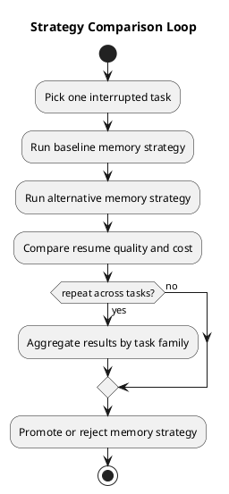

# MemoryVault strategy

Last updated: 2026-03-24

## What this project is now

MemoryVault is being developed as a tool, not as a domain-specific product.

The tool starts with almost no domain knowledge. Its job is to observe long-running work, test what gets lost across interruptions, and learn which kinds of memory actually help. It should become more effective over time by comparing strategies, not by assuming the right memory model from the start.

## Core stance

- Start with zero domain knowledge.
- Treat every early schema as a hypothesis, not as truth.
- Use simulated tasks or public Hugging Face datasets when real data would otherwise be required.
- Measure what the tool forgets, what it carries forward correctly, and what changes improve outcomes.
- Promote durable memory fields only after repeated evidence across tasks.

## Development phases

### Phase 0: Tool framing

Define the non-negotiable rules of the tool:

- the final goal must always stay visible
- raw history must remain recoverable
- resume packets must be inspectable
- every memory field must justify its existence by improving resumed work

### Phase 1: Synthetic task harness

Build a fully local harness that can:

- generate or load interrupted task traces
- replay them through the same memory loop
- score what was forgotten on resume
- log repeated misses

This phase should use synthetic traces first because they are cheap to create, easy to inspect, and easy to label with expected outcomes.

### Phase 2: Public benchmark adapters

Add adapters for public Hugging Face datasets so the tool can be tested beyond hand-made examples.

Good early benchmark groups:

- long-memory conversations
- tool-use plans and execution traces
- code issue resolution and agent trajectories
- long-form document question answering with evidence

The point is not to specialize in those domains. The point is to see which memory behaviors survive across very different task shapes.

### Phase 3: Memory field discovery

Use repeated misses to propose candidate durable fields.

Examples:

- hidden assumptions
- recent failed attempts
- unresolved open questions
- decision rationale
- source confidence

Only fields that repeatedly matter should graduate into the core memory model.

### Phase 4: Strategy comparison

Once the tool can run the same tasks with different memory strategies, compare them.

Examples:

- no memory vs goal-only memory
- resume packet only vs resume packet plus evidence
- hand-written extraction rules vs learned extraction rules
- short memory budget vs larger memory budget

The tool should keep a record of which strategy works better, on which task types, and at what cost.

The first concrete implementation of this phase now exists: the Memory Wind Tunnel in [docs/wind_tunnel.md](wind_tunnel.md). It removes one memory field at a time and measures the damage.

### Phase 5: Durable storage and retrieval

After the tool has enough evidence about useful memory fields, move from the local artifact store to durable structured storage.

At that point, Memgraph can become the long-term store for:

- durable memory fields
- relationships among tasks, failures, decisions, and sources
- retrieval paths for resuming work

The graph should come after field discovery, not before it.

### Phase 6: Learning how to become effective

In the later phase, the tool should do more than remember. It should learn which memory policies make it better.

That means:

- tracking which fields helped
- tracking which retrieval bundles were sufficient
- tracking which summaries caused harm
- tracking which strategies reduced repeated failure

The end state is a memory tool that improves by observing its own successes and misses.

### Cross-cutting requirement: observability

Every phase should stay observable.

That means:

- lifecycle logs for runs and wind tunnels
- per-run timing artifacts
- enough summary data to compare strategy cost and damage later

This is now started in [docs/observability.md](observability.md), but it should grow as the strategy-comparison layer grows.

## Data policy

At design time, do not assume access to real production traces.

Use two sources instead:

1. Synthetic traces created to expose known failure modes.
2. Public Hugging Face datasets that can be turned into interrupted-task evaluations.

This keeps the tool honest. It also avoids shaping the architecture around one narrow workflow too early.

## Immediate next phases

1. Expand the synthetic trace library so the wind tunnel sees more than one or two memory patterns.
2. Add Hugging Face adapters for at least one dataset from each major group: code, tool-use, long-memory conversation, and evidence-grounded documents.
3. Compare whole memory strategies, not only single-field removals.
4. Promote only the next few high-value fields, not a large schema all at once.
5. Delay graph complexity until the tool can already show that its learned fields improve resume quality across several task families.
