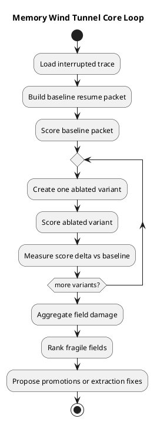
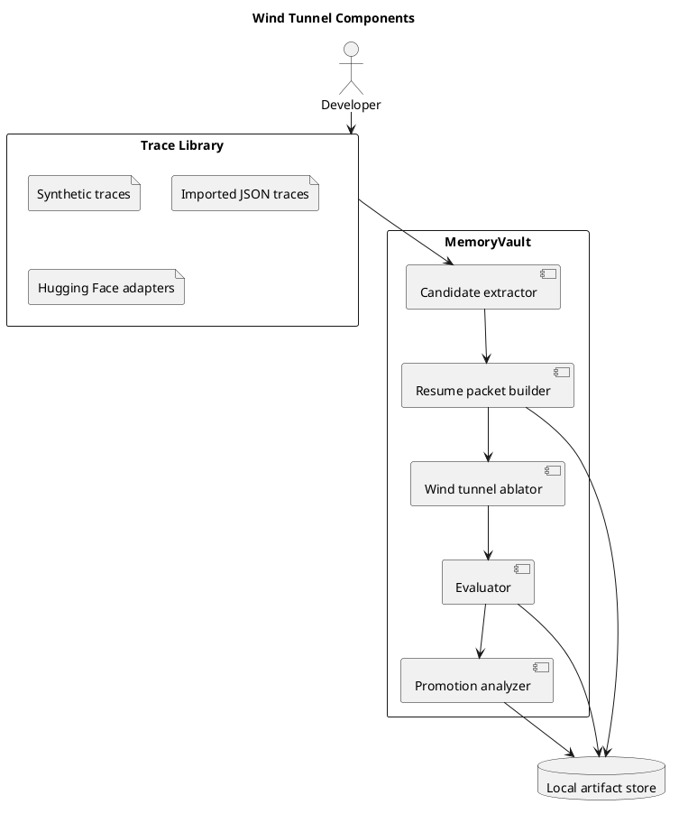

# Memory Wind Tunnel

Last updated: 2026-03-24

The Memory Wind Tunnel is the part of MemoryVault that asks a causal question:

Which parts of a resume packet actually matter?

Instead of only storing a task and scoring one resume result, the wind tunnel replays the same interrupted task with different memory fields removed. It then measures how much damage each removal causes.

## Why this exists

Without this step, the project can still overfit to nice-sounding memory fields.

The wind tunnel makes the tool tougher and more honest:

- it tests fields by removal instead of by intuition
- it ranks memory fields by actual damage
- it helps the tool decide what deserves promotion into durable memory
- it works with synthetic traces and public Hugging Face datasets

## Core loop

## System shape

## First implemented variants

The current version compares the baseline packet against these removals:

- remove goal reminder
- remove current focus
- remove constraints
- remove decisions
- remove assumptions
- remove recent failures
- remove lessons
- remove sources
- keep only the goal reminder

This is intentionally simple. It is enough to tell the tool which memory fields are fragile before the architecture gets more complex.

## What counts as a useful result

A useful wind-tunnel result should answer all of these:

- which removed field caused the biggest score drop?
- which fields seem cheap to remove?
- which fields only matter for some task families?
- which repeated misses should become durable fields?
- which extraction rules need improvement before field promotion?

## Near-term extensions

- add misleading-summary variants instead of only removal variants
- add field reordering variants to test prompt assembly effects
- compare entire memory strategies, not only single-field ablations
- run the same wind tunnel across synthetic traces and Hugging Face tasks
- keep a cross-run damage leaderboard so the tool can see what generalizes
